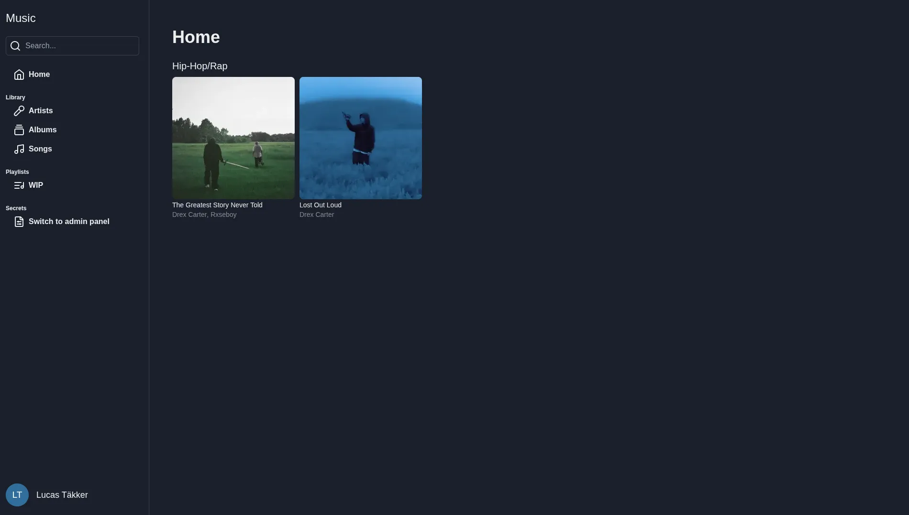
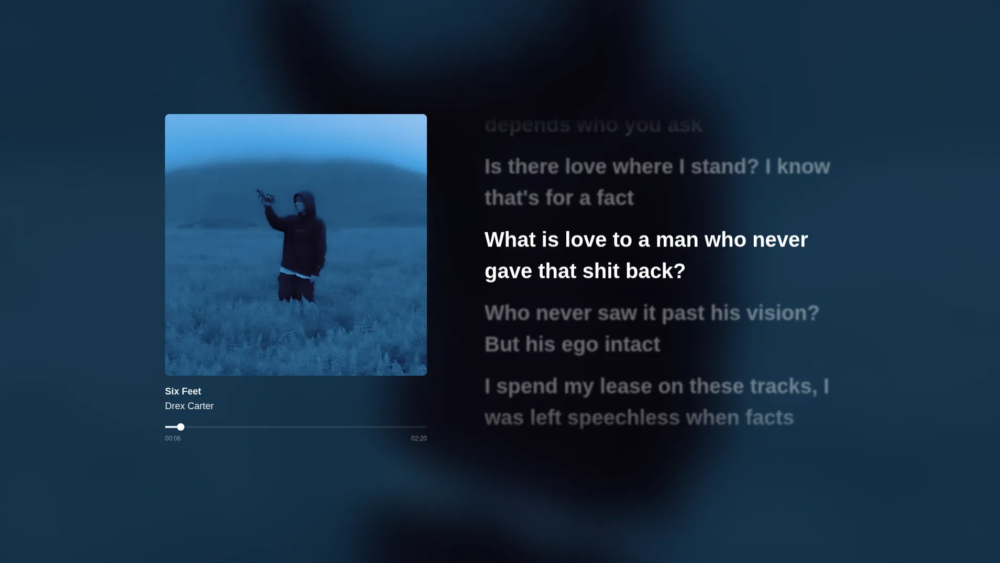

# Music

This project is a music website built with Next.js 
It was created as a learning project to explore component-based frontend development and basic application structure.

## Requirements

To run the project locally, you need both the frontend and [backend](https://github.com/Sniperhund/MusicBackend)

### Backend

1. Clone the backend repository
2. Copy `.env.example` to `.env` and fill in the required values. (SMTP needs to be filled, but can be garbage information)
3. Start the backend server (`npm i`, `npm run build` and `npm run start`)

### Frontend

1. Update `next.config.mjs` to point to the correct backend URL
2. Install dependencies: `npm i`
3. Start the development server: `npm run dev`
4. If test mode was enabled on the backend (`TEST=true` in .env), just create an account and log in immediately. It will automatically verify you, but will still show verification modal

## About the project

This project was developed during my studies. 
While the code is far from perfect, it demonstrates my approach to learning and building a website independently from idea to _somewhat_ working implementation. 
There is so many things I would've changed if I started it today (I am also working on a v2), so don't take this as my _best_

### Technologies Used

-   Next.js
-   JavaScript / TypeScript
-   CSS / Tailwind
-   Chakra UI
-   Howler
-   Other small packages.

### Status

This project is not actively maintained, except for major bugs.

## Pictures

_Note: The songs and lyrics shown are copyrighted and are only included for demonstration purposes_ 
 

